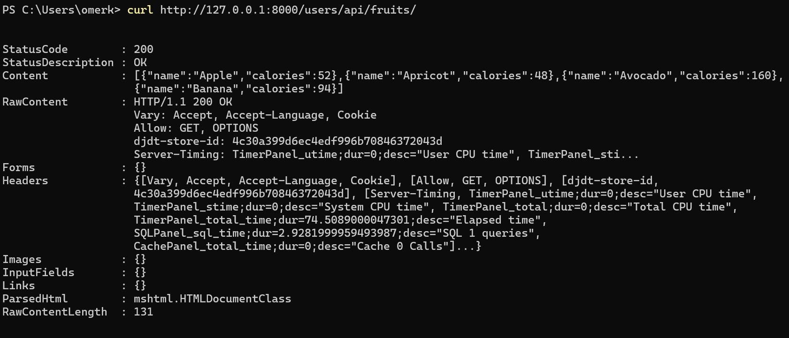

# Omer Django Project

This repository contains a sample web and REST API Django project developed as a coding task for 3IVIS. It demonstrates user authentication, data visualization, and the use of D3 charts in a Django web application.

**Author:** Omer Khan Jadoon

## Project Overview

This Django application is designed to render a D3 chart upon successful login and to provide chart data via a REST API after user authentication.

## Features

- User Authentication (Web and REST API)
- D3 Chart Integration (Using Django-NVD3)
- REST API Endpoint for Chart Data
- PostgreSQL Database with Sample Data for Demonstration
- Responsive and Interactive UI Components

## Project Structure

- **Backend:** Django with PostgreSQL for data storage
- **Frontend:** D3.js for charting, with Django templates for rendering
- **Environment Management:** pyenv and pip
- **JavaScript Dependencies:** npm for frontend libraries

---

## Prerequisites

- **Python** (version 3.10.0)
- **pyenv** and **pyenv-virtualenv**
- **Node.js** and **npm**
- **PostgreSQL**

---

## Setup Instructions

1. **Set up Python Environment**
   ```bash
   pyenv install 3.10.0
   pyenv virtualenv 3.10.0 djangoproject
   pyenv activate djangoproject
   ```

2. **Install Dependencies**
   - **Backend dependencies**:
     ```bash
     pip install cookiecutter
     pip install -r requirements/local.txt
     ```
   - **Frontend dependencies**:
     ```bash
     npm install
     ```

3. **Database Setup and Migrations**
   ```bash
   python manage.py makemigrations
   python manage.py migrate
   ```

4. **Run the Server**
   ```bash
   python manage.py runserver
   ```

---

## Adding Dummy Data to PostgreSQL

To populate the database with sample data:

1. Open the Django shell:
   ```bash
   python manage.py shell
   ```

2. Add sample data to the `Fruit` model:
   ```python
   from omerdjango.users.models import Fruit

   Fruit.objects.create(name="Apple", calories=52)
   Fruit.objects.create(name="Apricot", calories=48)
   Fruit.objects.create(name="Avocado", calories=160)
   Fruit.objects.create(name="Banana", calories=94)

   print("Dummy data added!")
   ```

3. Exit the shell by typing `exit()`.

---

## Troubleshooting

If you encounter tooltip-related errors, such as an error with `chart.tooltipContent`, please modify the following files in the `nvd3` package:

1. **File Paths and Modifications:**
   - **Path:** `pythonx.x/site-packages/nvd3/templates/content.html`
     - **Line:** Replace `chart.tooltipContent` with `chart.tooltip.contentGenerator` on lines 54 and 63.
   - **Path:** `pythonx.x/site-packages/nvd3/templates/piechart.html`
     - **Line:** Replace `chart.tooltipContent` with `chart.tooltip.contentGenerator` on line 18.

---

## Screenshots

Screenshots of the application are available in the `screenshots` folder within the repository. They showcase the login page, D3 chart rendering, and REST API responses.

| Screenshot                   | Description                      |
|------------------------------|----------------------------------|
|      | Login screen for user authentication |
|      | Sample D3 chart displaying data      |
|  | REST API response example            |

---

## Additional Notes

For more customization or specific troubleshooting, refer to the official documentation for **Django**, **D3.js**, and **NVD3** or consult the code comments for further insights into the implementation details.

---
